# AWS 

* Amazone 에서 운영하는 가상 서버 서비스 
* ec2 라는 서비스가 가장 많이 사용됨
* 현재 실제 서비스들에서 많이 사용되고 있다. 
* 서버 사용 시간 만큼 과금이 되는 서비스로 개인이 쓰기에는 조금 부담이 있는 금액
* 1년 동안 무료로 사용할 수 있음

## 서버 만들기 

### AWS 가입 및 서버 만들기

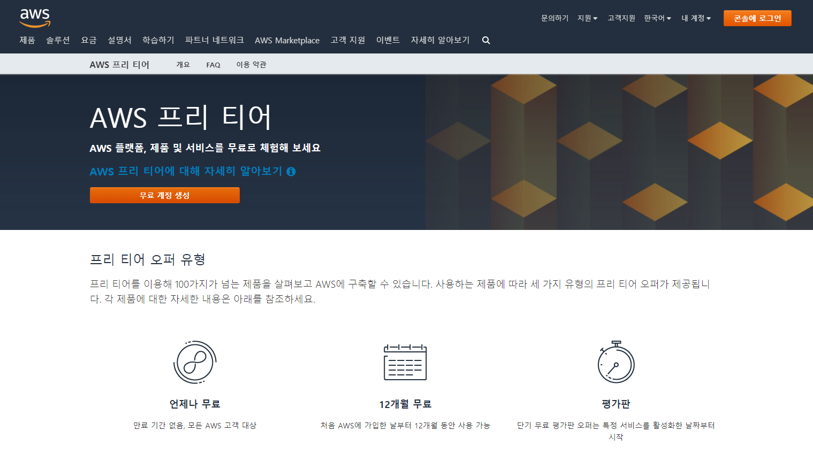

1) 무료 계정 생성을 통해서 계정을 만든다. 

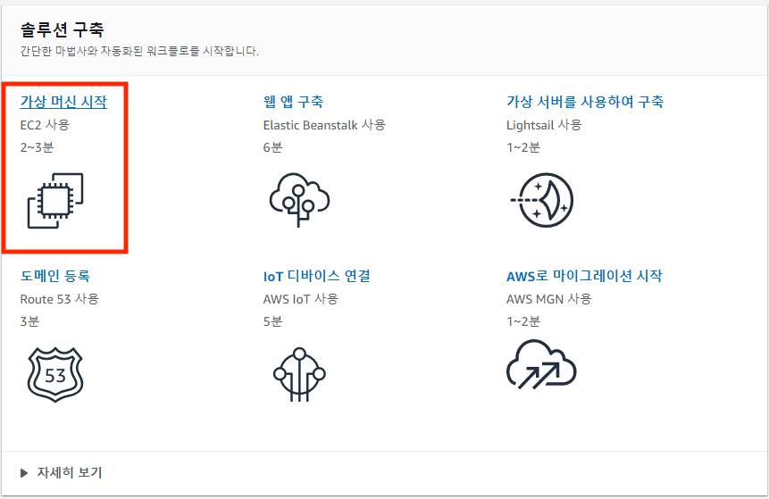

2) 가입 후 솔루션 구축에서 가상 머신 시작 선택

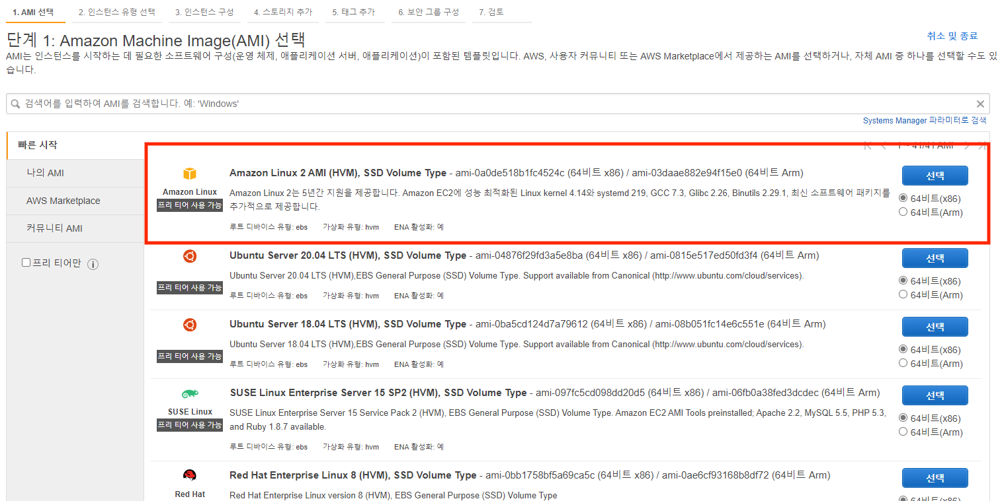

3) 가장 위에 있는 `Amazon Linux 2 AMI` 선택
    * 여러 OS 중에서 하나를 선택 하는 과정
    * `Amazon Linux 2 AMI` 가 현재 가장 많이 사용되고 있어서 레퍼런스가 풍부하다. 

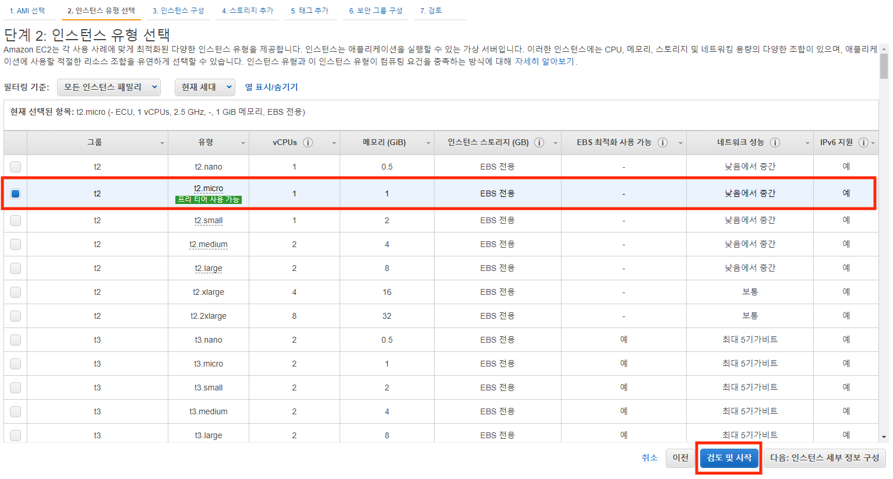

4) 무료로 사용가능한 t2.micro 를 선택한다. 
    * 서버의 하드웨어 사양을 선택하는 단계이다. 

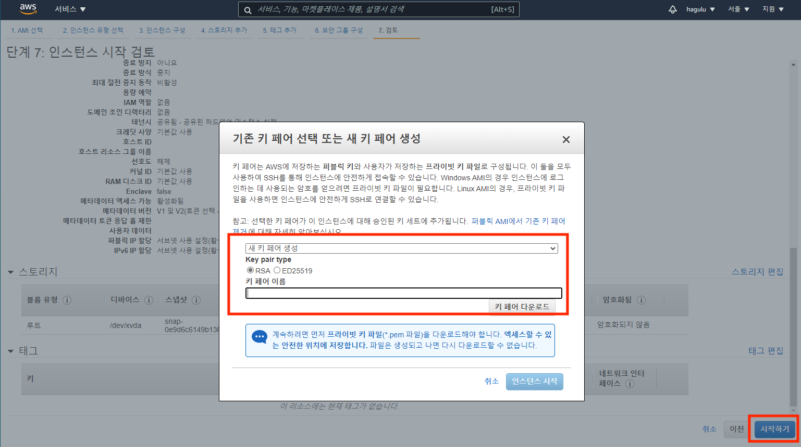

5) 쭉 기본으로 선택된 내용으로 진행하고 시작하기를 누른다. 
6) 키 생성 화면이 나타나는데 새로운 키생성을 선택하고, 생성한 키이름을 적고 다운로드를 누른다.
    * 해당 키를 통해서 로그인을 해야 하기 때문에 잘 보관해야한다. 
    * 키를 잃어 버리면 서버를 새로 만들어야 하므로 소중히 관리한다.
7) 인스턴스 시작하기를 누르면 서버가 설치되는 일정 시간을 지나서 완료가 된다. 

### 서버 정보 확인

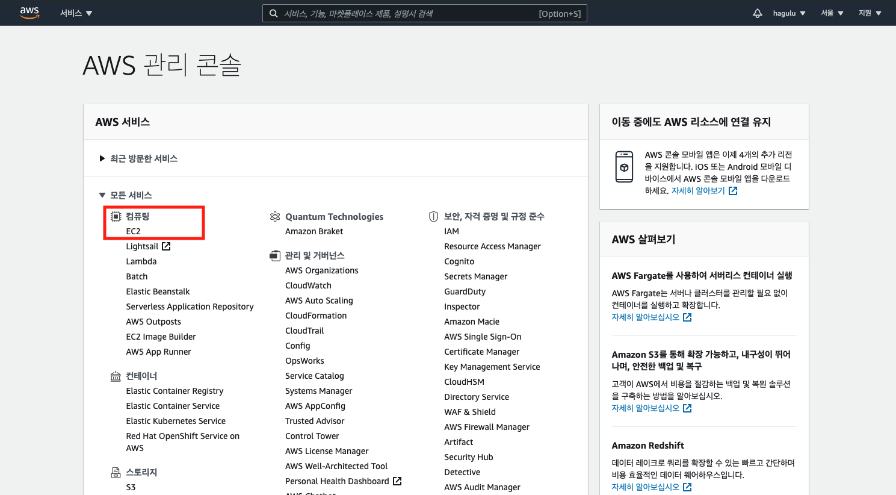

1) main 화면에서 모든서비스를 펼쳐서 ec2 를 선택한다. 

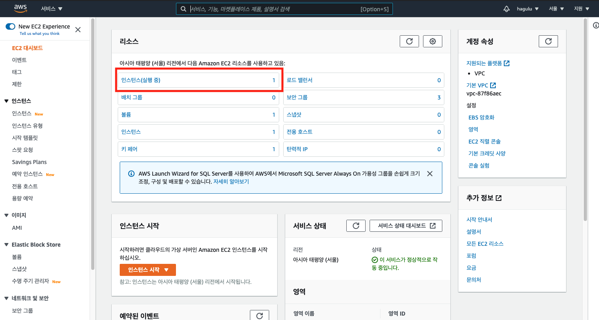

2) 인스턴스를 선택하여 들어 간다. 

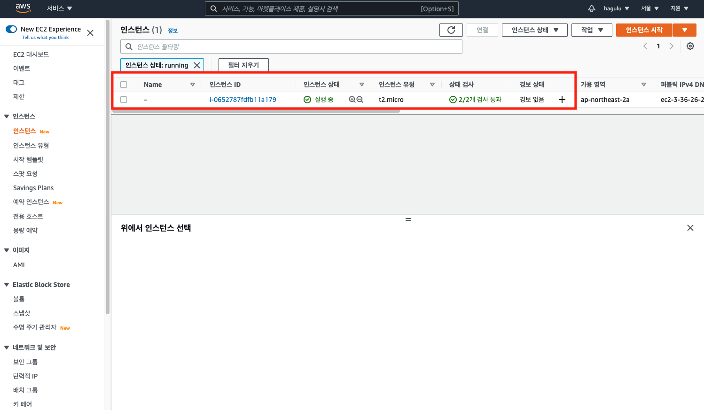

3) 현재 실행중인 서버를 선택한다. 

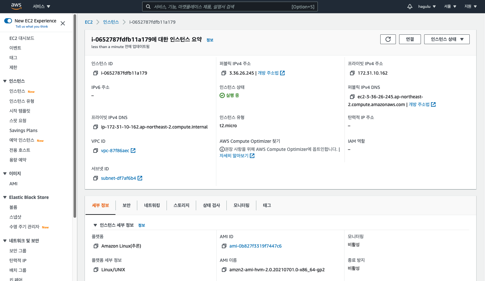

4) 해당 화면에서 접속에 필요한 정보를 확인한다. 

### 서버 접속

* putty 라고 하는 툴을 통해서 CLI 형태로 서버에 접속해서 서버를 운용한다. 
* 인증을 위해서 aws 에서 받은 키를 활용해야 하는데, putty 에서 사용하려면 변환이 필요하다.

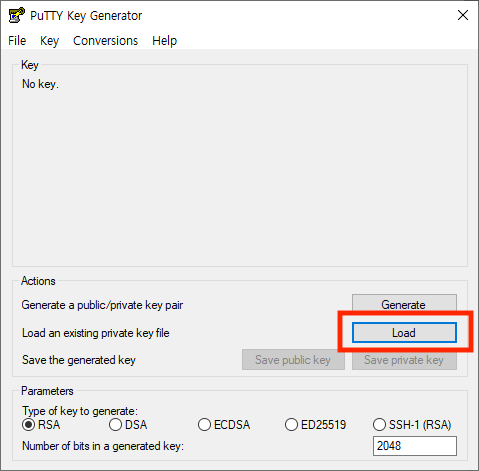

1) sourcetree 내 키 생성키를 열고 load 버튼을 누른다. 

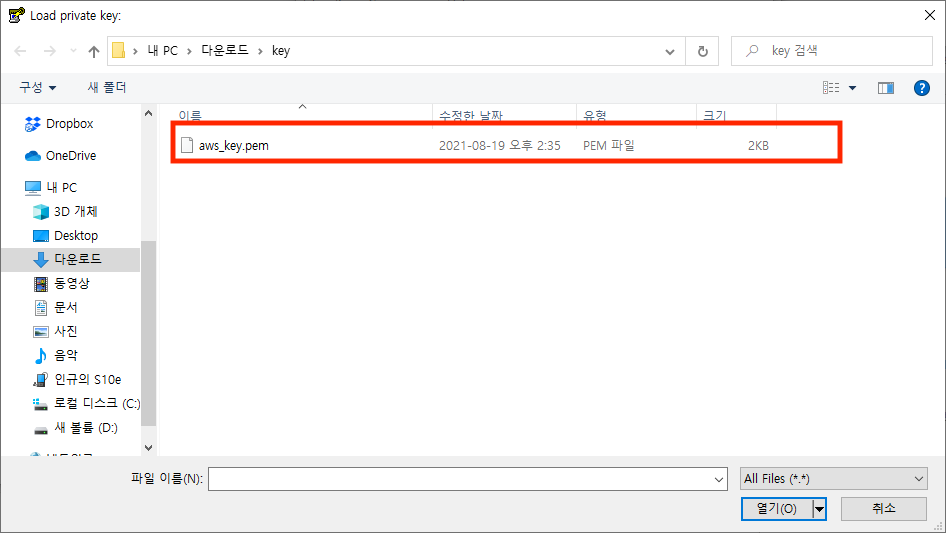

2) aws 에서 내려 받은 .pem 키파일을 선택한다. 

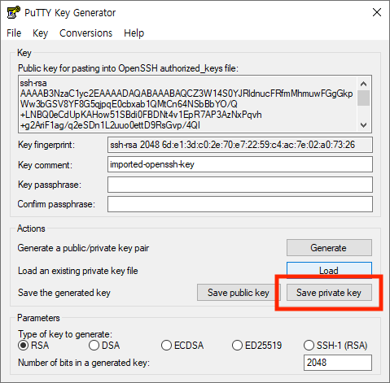

3) load가 되면 Save private key 버튼을 선택하고 키를 저장한다. 

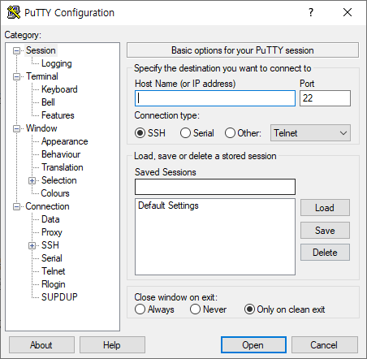

4) putty 실행 화면이다. 

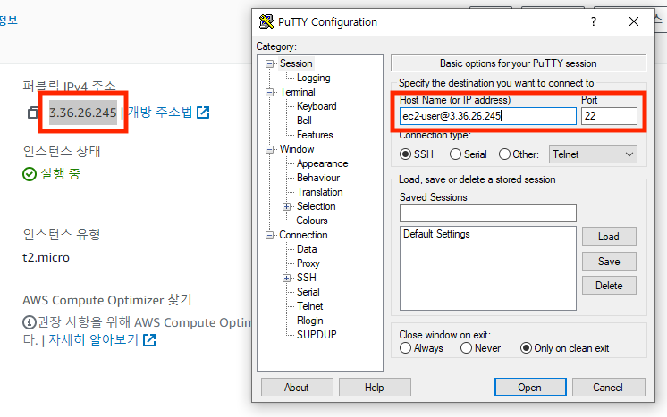

5) hostname 부분에 aws 서버 정보에서 퍼블릭 IPV4 주소를 참조해서 아래와 같이 입력한다. 
    * ec2-user@ip주소

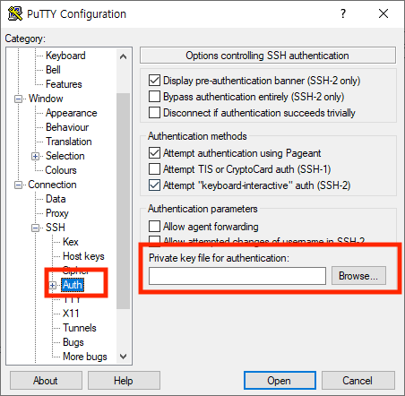

6) 왼쪽 메뉴 connection > ssh > Auth 를 선택한다.
위 캡쳐에 보이는 부분에 생성한 ppk key 를 불러온다. 

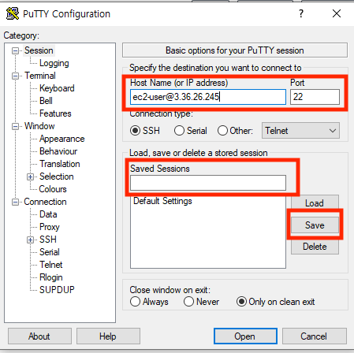

7) saved Session 에 저장할 이름을 지정하고 save 버튼을 눌러서 접속정보를 저장한다. 
그리고 open 버튼을 눌러서 접속을 한다. 